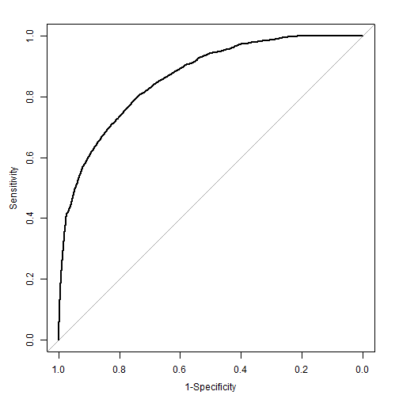

```r
library(tidyverse)
library(pROC)
library(car)
```


## Data Cleansing
We took 3 main steps to clean the data:
1) Change ordhist value to the sum of falord and sprord
2) Update the datelp6 year to match lpuryear where needed & Drop lpuryear
3) Create oldSales & oldOrds to capture the difference between the sum of the most recent 4 years of sales/orders and the total sales/orders


```r
#read data
csd <- read_csv("../catalog sales data.csv", 
                col_types = cols(datead6 = col_date(format = "%m/%d/%Y"), 
                                 datelp6 = col_date(format = "%m/%d/%Y")))

#1) create new ordhist by adding falord and sprord
csd$ordhist <- csd$falord + csd$sprord

#2) Update daltelp6
csd[is.na(csd$lpuryear) == FALSE & substr(csd$datelp6,4,4) < csd$lpuryear & as.numeric(paste0(substr(csd$datelp6,3,3),csd$lpuryear)) < 13,] <- csd %>% filter(is.na(lpuryear) == FALSE & substr(datelp6,4,4) < lpuryear & as.numeric(paste0(substr(datelp6,3,3),lpuryear)) < 13) %>%
  mutate(datelp6 = as.Date(paste0(substr(datelp6,1,3), lpuryear,"-06-30")))
```

```
## Warning in evalq(is.na(lpuryear) == FALSE & substr(datelp6, 4, 4) <
## lpuryear & : NAs introduced by coercion
```

```
## Warning in `[<-.data.frame`(`*tmp*`, is.na(csd$lpuryear) == FALSE &
## substr(csd$datelp6, : NAs introduced by coercion
```

```r
#Drop lpuryear
csd <- subset(csd, select = -c(lpuryear))
```


```r
#3) Adding columns for sales and orders more than 3 years ago
new_csd <- csd %>%
  mutate(oldOrds = sprord + falord - (ordtyr + ordlyr + ord2ago + ord3ago)) %>%
  mutate(oldSales = slshist - (slstyr + slslyr + sls2ago + sls3ago)) %>%
  #filter(!((as.integer(substr(datelp6,1,4)) - 3 <= as.integer(substr(datead6,1,4))) & (oldOrds != 0) & (oldSales !=0))) %>%
  mutate(oldOrds = ifelse(oldOrds < 0, 0, oldOrds))
```


```r
sales <- read_csv("../catalog sales data.csv", 
                col_types = cols(datead6 = col_date(format = "%m/%d/%Y"), 
                                 datelp6 = col_date(format = "%m/%d/%Y")))
```

The latest date: 2012/12/01

```r
new_csd <- new_csd %>%
  mutate(days = (2012-as.integer(substr(datelp6,1,4)))*12*30 + (12 - as.integer(substr(datelp6,6,7)))*30 + (1-as.integer(substr(datelp6,9,10)))) %>%
  mutate(recency = days/365)
```


```r
new_csd <- new_csd %>%
  mutate(factyr = ifelse(slstyr>0, 1, 0)) %>%
  mutate(faclyr = ifelse(slslyr>0, 1, 0)) %>%
  mutate(fac2ago = ifelse(sls2ago>0, 1, 0)) %>%
  mutate(fac3ago = ifelse(sls3ago>0, 1, 0))
```


```r
new_csd <- new_csd %>%
  mutate(avgtyr = ifelse(ordtyr>0, slstyr/ordtyr, 0)) %>%
  mutate(avglyr = ifelse(ordlyr>0, slslyr/ordlyr, 0)) %>%
  mutate(avg2ago = ifelse(ord2ago>0, sls2ago/ord2ago, 0)) %>%
  mutate(avg3ago = ifelse(ord3ago>0, sls3ago/ord3ago, 0)) %>%
  mutate(avghist = ifelse((falord+sprord)>0, slshist/(falord+sprord), 0))
```


```r
new_csd <- new_csd %>%
  mutate(targ_prob = ifelse(targdol > 0, 1, 0)) %>%
  mutate(factyr = ifelse(ordtyr>0, 1, ordtyr)) %>%
  mutate(factyr = factor(factyr, levels=c(0,1))) %>%
  mutate(faclyr = ifelse(ordlyr>0, 1, ordlyr)) %>%
  mutate(faclyr = factor(faclyr, levels=c(0,1))) %>%
  mutate(fac2ago = ifelse(ord2ago>0, 1, ord2ago)) %>%
  mutate(fac2ago = factor(fac2ago, levels=c(0,1))) %>%
  mutate(fac3ago = ifelse(ord3ago>0, 1, ord3ago)) %>%
  mutate(fac3ago = factor(fac3ago, levels=c(0,1)))
```


```r
new_csd <- new_csd %>%
  mutate(recency_fac = ifelse(recency>=5, 5, ifelse(recency>=4.75, 4.75,ifelse(recency>=4.5, 4.5, ifelse(recency>=4.25, 4.25, ifelse(recency>=4, 4, ifelse(recency>=3.75, 3.75,ifelse(recency>=3.5, 3.5, ifelse(recency>=3.25, 3.25, ifelse(recency>3, 3, ifelse(recency>=2.75, 2.75, ifelse(recency>=2.5, 2.5, ifelse(recency>=2.25, 2.25, ifelse(recency>=2, 2, ifelse(recency>=1.75, 1.75, ifelse(recency>=1.5, 1.5, ifelse(recency>=1.25, 1.25, ifelse(recency>=1, 1, ifelse(recency>=0.75, 0.75, ifelse(recency>=0.5, 0.5, ifelse(recency>=0.25, 0.25, 0 ))))))))))))))))))))) %>%
  mutate(recency_fac = factor(recency_fac))
```


```r
train <- new_csd[new_csd$train == 1,]
test <- new_csd[new_csd$train == 0,]
```

## Apply logistic model to predict whether the customer would buy.

Distribution of training and test data

```r
train$targ_prob <- ifelse(train$targdol > 0, 1, 0)
test$targ_prob <- ifelse(test$targdol > 0, 1, 0)
print('training data table:')
```

```
## [1] "training data table:"
```

```r
train_baseline <- table(train$targ_prob)
train_baseline
```

```
## 
##     0     1 
## 45573  4845
```

```r
print('test data table:')
```

```
## [1] "test data table:"
```

```r
test_baseline <- table(test$targ_prob)
test_baseline
```

```
## 
##     0     1 
## 46388  4726
```

Baseline accuracy:

```r
print('training data baseline:')
```

```
## [1] "training data baseline:"
```

```r
train_baseline[[1]]/sum(train_baseline)
```

```
## [1] 0.9039034
```

```r
print('test data baseline:')
```

```
## [1] "test data baseline:"
```

```r
test_baseline[[1]]/sum(test_baseline)
```

```
## [1] 0.90754
```

Utility function: calculate the measures of Correct Classification, based on confusion matrix, including accuracy, precision, recall, and F1_score.

```r
class_Measure <- function(conf_matrix){
  accuracy <- sum(diag(conf_matrix))/sum(conf_matrix)
  precision <- unname(conf_matrix[2,2]/colSums(conf_matrix)[2])
  recall <- unname(conf_matrix[2,2]/rowSums(conf_matrix)[2])
  f1_score <- unname(2*precision*recall/(precision+recall))
  list(Accuracy = accuracy, Precision = precision, Recall = recall, Fscore = f1_score)
}
```

Utility function: Scan the threshold for the highest F score by grid search

```r
search_cutoff <- function(data_resp, data_pred, step=0.01){
  
  cutoff <- seq(0, 0.99, step)
  Fscore_max <- 0
  F_threshold <- 0
  Accuracy_max <- 0
  Acc_threshold <- 0
  for (prob_thr in cutoff) {
    prob_pred <- ifelse(data_pred<prob_thr, 0, 1)
    prob_pred <- factor(prob_pred, levels=c(0,1))
    conf_matrix <- table(data_resp, prob_pred)
    pred_perf <- class_Measure(conf_matrix)
    if (pred_perf$Fscore > Fscore_max) {
      F_threshold <- prob_thr
      Fscore_max <- pred_perf$Fscore
    }
    if ((pred_perf$Accuracy) > Accuracy_max) {
      Acc_threshold <- prob_thr
      Accuracy_max <- pred_perf$Accuracy
    }
  }
  list(MaxFscore = Fscore_max, FsCutoff = F_threshold, MaxAccuracy = Accuracy_max, AccCutoff = Acc_threshold)
}
```


### Logistic model: consider both consistency and recency


```r
targ_prob_fit <- glm(targ_prob~faclyr+(faclyr:fac2ago)+(faclyr:fac2ago:fac3ago)+slshist+falord+sprord+recency_fac, data=train, family=binomial)
summary(targ_prob_fit)
```

```
## 
## Call:
## glm(formula = targ_prob ~ faclyr + (faclyr:fac2ago) + (faclyr:fac2ago:fac3ago) + 
##     slshist + falord + sprord + recency_fac, family = binomial, 
##     data = train)
## 
## Deviance Residuals: 
##     Min       1Q   Median       3Q      Max  
## -6.6368  -0.4027  -0.2319  -0.0001   3.0174  
## 
## Coefficients:
##                             Estimate Std. Error z value Pr(>|z|)    
## (Intercept)               -4.536e+00  1.884e-01 -24.069  < 2e-16 ***
## faclyr1                    8.733e-01  6.746e-02  12.946  < 2e-16 ***
## slshist                   -6.676e-04  1.489e-04  -4.483 7.35e-06 ***
## falord                     2.641e-01  1.437e-02  18.380  < 2e-16 ***
## sprord                     9.521e-02  1.913e-02   4.976 6.48e-07 ***
## recency_fac0.5             3.873e+00  1.885e-01  20.544  < 2e-16 ***
## recency_fac0.75            1.175e+00  2.078e-01   5.653 1.57e-08 ***
## recency_fac1               2.073e+00  1.885e-01  10.996  < 2e-16 ***
## recency_fac1.25           -1.625e+01  2.789e+02  -0.058  0.95353    
## recency_fac1.5             1.755e+00  1.987e-01   8.829  < 2e-16 ***
## recency_fac1.75           -1.649e+01  2.475e+02  -0.067  0.94690    
## recency_fac2               9.401e-01  1.943e-01   4.837 1.32e-06 ***
## recency_fac2.25           -1.645e+01  5.878e+02  -0.028  0.97768    
## recency_fac2.5             1.404e+00  2.156e-01   6.512 7.43e-11 ***
## recency_fac2.75           -1.589e+01  2.039e+02  -0.078  0.93789    
## recency_fac3               1.310e+00  2.038e-01   6.429 1.29e-10 ***
## recency_fac3.25           -1.597e+01  6.627e+02  -0.024  0.98077    
## recency_fac3.5             1.141e+00  2.299e-01   4.965 6.89e-07 ***
## recency_fac3.75            1.221e+00  2.131e-01   5.730 1.01e-08 ***
## recency_fac4              -1.580e+01  2.249e+02  -0.070  0.94398    
## recency_fac4.25           -1.553e+01  6.681e+02  -0.023  0.98146    
## recency_fac4.5             1.162e+00  2.392e-01   4.856 1.20e-06 ***
## recency_fac4.75            1.077e+00  2.131e-01   5.055 4.30e-07 ***
## recency_fac5               4.232e-01  1.972e-01   2.146  0.03188 *  
## faclyr0:fac2ago1           3.697e-01  8.190e-02   4.515 6.35e-06 ***
## faclyr1:fac2ago1           2.434e-01  8.218e-02   2.962  0.00306 ** 
## faclyr0:fac2ago0:fac3ago1  3.627e-01  9.014e-02   4.023 5.74e-05 ***
## faclyr1:fac2ago0:fac3ago1  1.346e-01  9.695e-02   1.389  0.16491    
## faclyr0:fac2ago1:fac3ago1  3.820e-01  9.058e-02   4.217 2.47e-05 ***
## faclyr1:fac2ago1:fac3ago1  1.527e-01  1.032e-01   1.481  0.13874    
## ---
## Signif. codes:  0 '***' 0.001 '**' 0.01 '*' 0.05 '.' 0.1 ' ' 1
## 
## (Dispersion parameter for binomial family taken to be 1)
## 
##     Null deviance: 31907  on 50417  degrees of freedom
## Residual deviance: 22525  on 50388  degrees of freedom
## AIC: 22585
## 
## Number of Fisher Scoring iterations: 18
```

```r
prob_fit_roc <- plot.roc(train$targ_prob, targ_prob_fit$fitted.values, xlim=c(1,0), xlab='1-Specificity')
```



```r
prob_fit_roc
```

```
## 
## Call:
## plot.roc.default(x = train$targ_prob, predictor = targ_prob_fit$fitted.values,     xlim = c(1, 0), xlab = "1-Specificity")
## 
## Data: targ_prob_fit$fitted.values in 45573 controls (train$targ_prob 0) < 4845 cases (train$targ_prob 1).
## Area under the curve: 0.8624
```


```r
print('on training set')
```

```
## [1] "on training set"
```

```r
prob_cutoff <- search_cutoff(train$targ_prob, targ_prob_fit$fitted.values)

print('on test set')
```

```
## [1] "on test set"
```

```r
targ_test_pred <- predict(targ_prob_fit, newdata=test, type='response')

print('Base on the highest Accuracy of training set')
```

```
## [1] "Base on the highest Accuracy of training set"
```

```r
test_ord <- table(test$targ_prob, targ_test_pred > prob_cutoff$AccCutoff)
class_Measure(test_ord)
```

```
## $Accuracy
## [1] 0.9235826
## 
## $Precision
## [1] 0.6563692
## 
## $Recall
## [1] 0.3641557
## 
## $Fscore
## [1] 0.4684268
```

```r
print('Base on the highest F scocre of training set')
```

```
## [1] "Base on the highest F scocre of training set"
```

```r
test_ord <- table(test$targ_prob, targ_test_pred > prob_cutoff$FsCutoff)
class_Measure(test_ord)
```

```
## $Accuracy
## [1] 0.9210784
## 
## $Precision
## [1] 0.6042169
## 
## $Recall
## [1] 0.4244604
## 
## $Fscore
## [1] 0.4986329
```

```r
prob_cutoff
```

```
## $MaxFscore
## [1] 0.4991364
## 
## $FsCutoff
## [1] 0.36
## 
## $MaxAccuracy
## [1] 0.9206038
## 
## $AccCutoff
## [1] 0.42
```


```r
vif(targ_prob_fit)
```

```
##                             GVIF Df GVIF^(1/(2*Df))
## faclyr                  3.385145  1        1.839876
## slshist                 1.833948  1        1.354234
## falord                  2.412044  1        1.553076
## sprord                  1.800654  1        1.341885
## recency_fac            17.259663 19        1.077838
## faclyr:fac2ago          7.769127  2        1.669526
## faclyr:fac2ago:fac3ago  9.386286  4        1.323006
```

