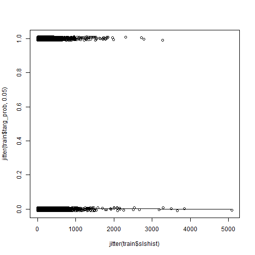
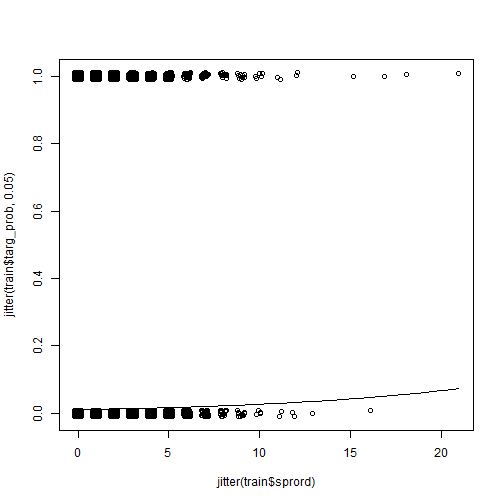
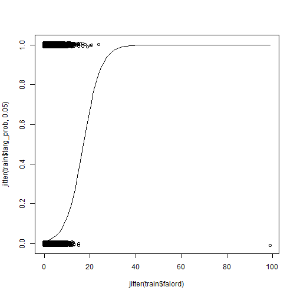
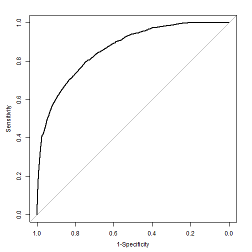

```r
library(tidyverse)
```

```
## Loading tidyverse: ggplot2
## Loading tidyverse: tibble
## Loading tidyverse: tidyr
## Loading tidyverse: readr
## Loading tidyverse: purrr
## Loading tidyverse: dplyr
```

```
## Conflicts with tidy packages ----------------------------------------------
```

```
## filter(): dplyr, stats
## lag():    dplyr, stats
```

```r
library(pROC)
```

```
## Warning: package 'pROC' was built under R version 3.4.2
```

```
## Type 'citation("pROC")' for a citation.
```

```
## 
## Attaching package: 'pROC'
```

```
## The following objects are masked from 'package:stats':
## 
##     cov, smooth, var
```

```r
library(car)
```

```
## 
## Attaching package: 'car'
```

```
## The following object is masked from 'package:dplyr':
## 
##     recode
```

```
## The following object is masked from 'package:purrr':
## 
##     some
```


## Data Cleansing
We took 3 main steps to clean the data:
1) Change ordhist value to the sum of falord and sprord
2) Update the datelp6 year to match lpuryear where needed & Drop lpuryear
3) Create oldSales & oldOrds to capture the difference between the sum of the most recent 4 years of sales/orders and the total sales/orders


```r
#read data
csd <- read_csv("../catalog sales data.csv", 
                col_types = cols(datead6 = col_date(format = "%m/%d/%Y"), 
                                 datelp6 = col_date(format = "%m/%d/%Y")))

#1) create new ordhist by adding falord and sprord
csd$ordhist <- csd$falord + csd$sprord

#2) Update daltelp6
csd[is.na(csd$lpuryear) == FALSE & substr(csd$datelp6,4,4) < csd$lpuryear & as.numeric(paste0(substr(csd$datelp6,3,3),csd$lpuryear)) < 13,] <- csd %>% filter(is.na(lpuryear) == FALSE & substr(datelp6,4,4) < lpuryear & as.numeric(paste0(substr(datelp6,3,3),lpuryear)) < 13) %>%
  mutate(datelp6 = as.Date(paste0(substr(datelp6,1,3), lpuryear,"-06-30")))
```

```
## Warning in evalq(is.na(lpuryear) == FALSE & substr(datelp6, 4, 4) <
## lpuryear & : NAs introduced by coercion
```

```
## Warning in `[<-.data.frame`(`*tmp*`, is.na(csd$lpuryear) == FALSE &
## substr(csd$datelp6, : NAs introduced by coercion
```

```r
#Drop lpuryear
csd <- subset(csd, select = -c(lpuryear))
```


```r
#3) Adding columns for sales and orders more than 3 years ago
new_csd <- csd %>%
  mutate(oldOrds = sprord + falord - (ordtyr + ordlyr + ord2ago + ord3ago)) %>%
  mutate(oldSales = slshist - (slstyr + slslyr + sls2ago + sls3ago)) %>%
  #filter(!((as.integer(substr(datelp6,1,4)) - 3 <= as.integer(substr(datead6,1,4))) & (oldOrds != 0) & (oldSales !=0))) %>%
  mutate(oldOrds = ifelse(oldOrds < 0, 0, oldOrds))
```


```r
sales <- read_csv("../catalog sales data.csv", 
                col_types = cols(datead6 = col_date(format = "%m/%d/%Y"), 
                                 datelp6 = col_date(format = "%m/%d/%Y")))
```

The latest date: 2012/12/01

```r
new_csd <- new_csd %>%
  mutate(days = (2012-as.integer(substr(datelp6,1,4)))*12*30 + (12 - as.integer(substr(datelp6,6,7)))*30 + (1-as.integer(substr(datelp6,9,10)))) %>%
  mutate(recency = days/365)
```


```r
new_csd <- new_csd %>%
  mutate(factyr = ifelse(slstyr>0, 1, 0)) %>%
  mutate(faclyr = ifelse(slslyr>0, 1, 0)) %>%
  mutate(fac2ago = ifelse(sls2ago>0, 1, 0)) %>%
  mutate(fac3ago = ifelse(sls3ago>0, 1, 0))
```


```r
new_csd <- new_csd %>%
  mutate(avgtyr = ifelse(ordtyr>0, slstyr/ordtyr, 0)) %>%
  mutate(avglyr = ifelse(ordlyr>0, slslyr/ordlyr, 0)) %>%
  mutate(avg2ago = ifelse(ord2ago>0, sls2ago/ord2ago, 0)) %>%
  mutate(avg3ago = ifelse(ord3ago>0, sls3ago/ord3ago, 0)) %>%
  mutate(avghist = ifelse((falord+sprord)>0, slshist/(falord+sprord), 0))
```


```r
new_csd <- new_csd %>%
  mutate(targ_prob = ifelse(targdol > 0, 1, 0)) %>%
  mutate(factyr = ifelse(ordtyr>0, 1, ordtyr)) %>%
  mutate(factyr = factor(factyr, levels=c(0,1))) %>%
  mutate(faclyr = ifelse(ordlyr>0, 1, ordlyr)) %>%
  mutate(faclyr = factor(faclyr, levels=c(0,1))) %>%
  mutate(fac2ago = ifelse(ord2ago>0, 1, ord2ago)) %>%
  mutate(fac2ago = factor(fac2ago, levels=c(0,1))) %>%
  mutate(fac3ago = ifelse(ord3ago>0, 1, ord3ago)) %>%
  mutate(fac3ago = factor(fac3ago, levels=c(0,1)))
```


```r
new_csd <- new_csd %>%
  mutate(recency_fac = ifelse(recency>=5, 5, ifelse(recency>=4.75, 4.75,ifelse(recency>=4.5, 4.5, ifelse(recency>=4.25, 4.25, ifelse(recency>=4, 4, ifelse(recency>=3.75, 3.75,ifelse(recency>=3.5, 3.5, ifelse(recency>=3.25, 3.25, ifelse(recency>3, 3, ifelse(recency>=2.75, 2.75, ifelse(recency>=2.5, 2.5, ifelse(recency>=2.25, 2.25, ifelse(recency>=2, 2, ifelse(recency>=1.75, 1.75, ifelse(recency>=1.5, 1.5, ifelse(recency>=1.25, 1.25, ifelse(recency>=1, 1, ifelse(recency>=0.75, 0.75, ifelse(recency>=0.5, 0.5, ifelse(recency>=0.25, 0.25, 0 ))))))))))))))))))))) %>%
  mutate(recency_fac = factor(recency_fac))
```

Make days_on as days since added

```r
new_csd$days_on <- as.numeric(as.Date('2012/12/1') - new_csd$datead6)
summary(new_csd$days_on)
```

```
##    Min. 1st Qu.  Median    Mean 3rd Qu.    Max. 
##       1    1048    1786    2108    2622   29769
```


```r
new_csd
```

```
## # A tibble: 101,532 x 32
##    targdol    datead6    datelp6 slstyr slslyr sls2ago sls3ago slshist
##      <dbl>     <date>     <date>  <int>  <int>   <int>   <int>   <int>
##  1       0 1980-01-01 1980-01-01      0      0       0       0       0
##  2       0 1980-01-01 1980-01-01      0      0       0       0       0
##  3       0 1980-01-01 1980-01-01      0      0       0       0       0
##  4       0 1980-01-01 1980-01-01      0      0       0       0       0
##  5       0 1980-01-01 1980-01-01      0      0       0       0       0
##  6       0 1980-01-01 1980-01-01      0      0       0       0       0
##  7       0 1980-01-01 1980-01-01      0      0       0       0       0
##  8       0 1980-01-01 1980-01-01      0      0       0       0       0
##  9       0 1980-01-01 1980-01-01      0      0       0       0       0
## 10       0 1980-01-01 1980-01-01      0      0       0       0       0
## # ... with 101,522 more rows, and 24 more variables: ordtyr <int>,
## #   ordlyr <int>, ord2ago <int>, ord3ago <int>, ordhist <int>,
## #   falord <int>, sprord <int>, train <int>, oldOrds <dbl>,
## #   oldSales <int>, days <dbl>, recency <dbl>, factyr <fctr>,
## #   faclyr <fctr>, fac2ago <fctr>, fac3ago <fctr>, avgtyr <dbl>,
## #   avglyr <dbl>, avg2ago <dbl>, avg3ago <dbl>, avghist <dbl>,
## #   targ_prob <dbl>, recency_fac <fctr>, days_on <dbl>
```


```r
train <- new_csd[new_csd$train == 1,]
test <- new_csd[new_csd$train == 0,]
```

## Apply logistic model to predict whether the customer would buy.

Distribution of training and test data

```r
train$targ_prob <- ifelse(train$targdol > 0, 1, 0)
test$targ_prob <- ifelse(test$targdol > 0, 1, 0)
print('training data table:')
```

```
## [1] "training data table:"
```

```r
train_baseline <- table(train$targ_prob)
train_baseline
```

```
## 
##     0     1 
## 45573  4845
```

```r
print('test data table:')
```

```
## [1] "test data table:"
```

```r
test_baseline <- table(test$targ_prob)
test_baseline
```

```
## 
##     0     1 
## 46388  4726
```

Baseline accuracy:

```r
print('training data baseline:')
```

```
## [1] "training data baseline:"
```

```r
train_baseline[[1]]/sum(train_baseline)
```

```
## [1] 0.9039034
```

```r
print('test data baseline:')
```

```
## [1] "test data baseline:"
```

```r
test_baseline[[1]]/sum(test_baseline)
```

```
## [1] 0.90754
```

Utility function: calculate the measures of Correct Classification, based on confusion matrix, including accuracy, precision, recall, and F1_score.

```r
class_Measure <- function(conf_matrix){
  accuracy <- sum(diag(conf_matrix))/sum(conf_matrix)
  precision <- unname(conf_matrix[2,2]/colSums(conf_matrix)[2])
  recall <- unname(conf_matrix[2,2]/rowSums(conf_matrix)[2])
  f1_score <- unname(2*precision*recall/(precision+recall))
  list(Accuracy = accuracy, Precision = precision, Recall = recall, Fscore = f1_score)
}
```

Utility function: Scan the threshold for the highest F score by grid search

```r
search_cutoff <- function(data_resp, data_pred, step=0.01){
  
  cutoff <- seq(0, 0.99, step)
  Fscore_max <- 0
  F_threshold <- 0
  Accuracy_max <- 0
  Acc_threshold <- 0
  for (prob_thr in cutoff) {
    prob_pred <- ifelse(data_pred<prob_thr, 0, 1)
    prob_pred <- factor(prob_pred, levels=c(0,1))
    conf_matrix <- table(data_resp, prob_pred)
    pred_perf <- class_Measure(conf_matrix)
    if (pred_perf$Fscore > Fscore_max) {
      F_threshold <- prob_thr
      Fscore_max <- pred_perf$Fscore
    }
    if ((pred_perf$Accuracy) > Accuracy_max) {
      Acc_threshold <- prob_thr
      Accuracy_max <- pred_perf$Accuracy
    }
  }
  list(MaxFscore = Fscore_max, FsCutoff = F_threshold, MaxAccuracy = Accuracy_max, AccCutoff = Acc_threshold)
}
```


### Logistic model: consider both consistency and recency


```r
targ_prob_fit <- glm(targ_prob~faclyr+(faclyr:fac2ago)+(faclyr:fac2ago:fac3ago)+slshist+falord+sprord+recency_fac, data=train, family=binomial)
summary(targ_prob_fit)
```

```
## 
## Call:
## glm(formula = targ_prob ~ faclyr + (faclyr:fac2ago) + (faclyr:fac2ago:fac3ago) + 
##     slshist + falord + sprord + recency_fac, family = binomial, 
##     data = train)
## 
## Deviance Residuals: 
##     Min       1Q   Median       3Q      Max  
## -6.6368  -0.4027  -0.2319  -0.0001   3.0174  
## 
## Coefficients:
##                             Estimate Std. Error z value Pr(>|z|)    
## (Intercept)               -4.536e+00  1.884e-01 -24.069  < 2e-16 ***
## faclyr1                    8.733e-01  6.746e-02  12.946  < 2e-16 ***
## slshist                   -6.676e-04  1.489e-04  -4.483 7.35e-06 ***
## falord                     2.641e-01  1.437e-02  18.380  < 2e-16 ***
## sprord                     9.521e-02  1.913e-02   4.976 6.48e-07 ***
## recency_fac0.5             3.873e+00  1.885e-01  20.544  < 2e-16 ***
## recency_fac0.75            1.175e+00  2.078e-01   5.653 1.57e-08 ***
## recency_fac1               2.073e+00  1.885e-01  10.996  < 2e-16 ***
## recency_fac1.25           -1.625e+01  2.789e+02  -0.058  0.95353    
## recency_fac1.5             1.755e+00  1.987e-01   8.829  < 2e-16 ***
## recency_fac1.75           -1.649e+01  2.475e+02  -0.067  0.94690    
## recency_fac2               9.401e-01  1.943e-01   4.837 1.32e-06 ***
## recency_fac2.25           -1.645e+01  5.878e+02  -0.028  0.97768    
## recency_fac2.5             1.404e+00  2.156e-01   6.512 7.43e-11 ***
## recency_fac2.75           -1.589e+01  2.039e+02  -0.078  0.93789    
## recency_fac3               1.310e+00  2.038e-01   6.429 1.29e-10 ***
## recency_fac3.25           -1.597e+01  6.627e+02  -0.024  0.98077    
## recency_fac3.5             1.141e+00  2.299e-01   4.965 6.89e-07 ***
## recency_fac3.75            1.221e+00  2.131e-01   5.730 1.01e-08 ***
## recency_fac4              -1.580e+01  2.249e+02  -0.070  0.94398    
## recency_fac4.25           -1.553e+01  6.681e+02  -0.023  0.98146    
## recency_fac4.5             1.162e+00  2.392e-01   4.856 1.20e-06 ***
## recency_fac4.75            1.077e+00  2.131e-01   5.055 4.30e-07 ***
## recency_fac5               4.232e-01  1.972e-01   2.146  0.03188 *  
## faclyr0:fac2ago1           3.697e-01  8.190e-02   4.515 6.35e-06 ***
## faclyr1:fac2ago1           2.434e-01  8.218e-02   2.962  0.00306 ** 
## faclyr0:fac2ago0:fac3ago1  3.627e-01  9.014e-02   4.023 5.74e-05 ***
## faclyr1:fac2ago0:fac3ago1  1.346e-01  9.695e-02   1.389  0.16491    
## faclyr0:fac2ago1:fac3ago1  3.820e-01  9.058e-02   4.217 2.47e-05 ***
## faclyr1:fac2ago1:fac3ago1  1.527e-01  1.032e-01   1.481  0.13874    
## ---
## Signif. codes:  0 '***' 0.001 '**' 0.01 '*' 0.05 '.' 0.1 ' ' 1
## 
## (Dispersion parameter for binomial family taken to be 1)
## 
##     Null deviance: 31907  on 50417  degrees of freedom
## Residual deviance: 22525  on 50388  degrees of freedom
## AIC: 22585
## 
## Number of Fisher Scoring iterations: 18
```

```r
prob_fit_roc <- plot.roc(train$targ_prob, targ_prob_fit$fitted.values, xlim=c(1,0), xlab='1-Specificity')
```


```r
prob_fit_roc
```

```
## 
## Call:
## plot.roc.default(x = train$targ_prob, predictor = targ_prob_fit$fitted.values,     xlim = c(1, 0), xlab = "1-Specificity")
## 
## Data: targ_prob_fit$fitted.values in 45573 controls (train$targ_prob 0) < 4845 cases (train$targ_prob 1).
## Area under the curve: 0.8624
```

### gelman's book

```r
library(arm)
```

```
## Warning: package 'arm' was built under R version 3.4.2
```

```
## Loading required package: MASS
```

```
## 
## Attaching package: 'MASS'
```

```
## The following object is masked from 'package:dplyr':
## 
##     select
```

```
## Loading required package: Matrix
```

```
## 
## Attaching package: 'Matrix'
```

```
## The following object is masked from 'package:tidyr':
## 
##     expand
```

```
## Loading required package: lme4
```

```
## 
## arm (Version 1.9-3, built: 2016-11-21)
```

```
## Working directory is C:/Users/Jerry/Documents/Rdata/MSiA_401_lab/Project
```

```
## 
## Attaching package: 'arm'
```

```
## The following object is masked from 'package:car':
## 
##     logit
```


```r
display(targ_prob_fit)
```

```
## glm(formula = targ_prob ~ faclyr + (faclyr:fac2ago) + (faclyr:fac2ago:fac3ago) + 
##     slshist + falord + sprord + recency_fac, family = binomial, 
##     data = train)
##                           coef.est coef.se
## (Intercept)                -4.54     0.19 
## faclyr1                     0.87     0.07 
## slshist                     0.00     0.00 
## falord                      0.26     0.01 
## sprord                      0.10     0.02 
## recency_fac0.5              3.87     0.19 
## recency_fac0.75             1.17     0.21 
## recency_fac1                2.07     0.19 
## recency_fac1.25           -16.25   278.92 
## recency_fac1.5              1.75     0.20 
## recency_fac1.75           -16.49   247.55 
## recency_fac2                0.94     0.19 
## recency_fac2.25           -16.45   587.79 
## recency_fac2.5              1.40     0.22 
## recency_fac2.75           -15.89   203.90 
## recency_fac3                1.31     0.20 
## recency_fac3.25           -15.97   662.73 
## recency_fac3.5              1.14     0.23 
## recency_fac3.75             1.22     0.21 
## recency_fac4              -15.80   224.92 
## recency_fac4.25           -15.53   668.14 
## recency_fac4.5              1.16     0.24 
## recency_fac4.75             1.08     0.21 
## recency_fac5                0.42     0.20 
## faclyr0:fac2ago1            0.37     0.08 
## faclyr1:fac2ago1            0.24     0.08 
## faclyr0:fac2ago0:fac3ago1   0.36     0.09 
## faclyr1:fac2ago0:fac3ago1   0.13     0.10 
## faclyr0:fac2ago1:fac3ago1   0.38     0.09 
## faclyr1:fac2ago1:fac3ago1   0.15     0.10 
## ---
##   n = 50418, k = 30
##   residual deviance = 22524.6, null deviance = 31906.6 (difference = 9382.0)
```


```r
plot(jitter(train$targ_prob, 0.05) ~ jitter(train$slshist))
curve(invlogit (coef(targ_prob_fit)[1] + coef(targ_prob_fit)['slshist']*x), add=TRUE)
```




```r
plot(jitter(train$targ_prob, 0.05) ~ jitter(train$sprord))
curve(invlogit (coef(targ_prob_fit)[1] + coef(targ_prob_fit)['sprord']*x), add=TRUE)
```



#outlier in falord

```r
plot(jitter(train$targ_prob, 0.05) ~ jitter(train$falord))
curve(invlogit (coef(targ_prob_fit)[1] + coef(targ_prob_fit)['falord']*x), add=TRUE)
```




### Performance Measure

```r
print('on training set')
```

```
## [1] "on training set"
```

```r
prob_cutoff <- search_cutoff(train$targ_prob, targ_prob_fit$fitted.values)

print('on test set')
```

```
## [1] "on test set"
```

```r
targ_test_pred <- predict(targ_prob_fit, newdata=test, type='response')

print('Base on the highest Accuracy of training set')
```

```
## [1] "Base on the highest Accuracy of training set"
```

```r
test_ord <- table(test$targ_prob, targ_test_pred > prob_cutoff$AccCutoff)
class_Measure(test_ord)
```

```
## $Accuracy
## [1] 0.9235826
## 
## $Precision
## [1] 0.6563692
## 
## $Recall
## [1] 0.3641557
## 
## $Fscore
## [1] 0.4684268
```

```r
print('Base on the highest F scocre of training set')
```

```
## [1] "Base on the highest F scocre of training set"
```

```r
test_ord <- table(test$targ_prob, targ_test_pred > prob_cutoff$FsCutoff)
class_Measure(test_ord)
```

```
## $Accuracy
## [1] 0.9210784
## 
## $Precision
## [1] 0.6042169
## 
## $Recall
## [1] 0.4244604
## 
## $Fscore
## [1] 0.4986329
```

```r
prob_cutoff
```

```
## $MaxFscore
## [1] 0.4991364
## 
## $FsCutoff
## [1] 0.36
## 
## $MaxAccuracy
## [1] 0.9206038
## 
## $AccCutoff
## [1] 0.42
```


### use avghist (=slshist/(falord+sprord)) instead of slshist

```r
targ_prob_fit <- glm(targ_prob~faclyr+(faclyr:fac2ago)+(faclyr:fac2ago:fac3ago)+avghist+falord+sprord+recency_fac, data=train, family=binomial)
summary(targ_prob_fit)
```

```
## 
## Call:
## glm(formula = targ_prob ~ faclyr + (faclyr:fac2ago) + (faclyr:fac2ago:fac3ago) + 
##     avghist + falord + sprord + recency_fac, family = binomial, 
##     data = train)
## 
## Deviance Residuals: 
##     Min       1Q   Median       3Q      Max  
## -6.1947  -0.4062  -0.2323  -0.0001   3.1607  
## 
## Coefficients:
##                             Estimate Std. Error z value Pr(>|z|)    
## (Intercept)               -4.457e+00  1.893e-01 -23.550  < 2e-16 ***
## faclyr1                    8.744e-01  6.744e-02  12.966  < 2e-16 ***
## avghist                   -1.640e-03  4.783e-04  -3.428 0.000607 ***
## falord                     2.340e-01  1.267e-02  18.474  < 2e-16 ***
## sprord                     6.805e-02  1.826e-02   3.726 0.000194 ***
## recency_fac0.5             3.866e+00  1.882e-01  20.541  < 2e-16 ***
## recency_fac0.75            1.172e+00  2.074e-01   5.649 1.62e-08 ***
## recency_fac1               2.067e+00  1.882e-01  10.981  < 2e-16 ***
## recency_fac1.25           -1.626e+01  2.791e+02  -0.058 0.953537    
## recency_fac1.5             1.744e+00  1.984e-01   8.789  < 2e-16 ***
## recency_fac1.75           -1.650e+01  2.475e+02  -0.067 0.946847    
## recency_fac2               9.354e-01  1.940e-01   4.822 1.42e-06 ***
## recency_fac2.25           -1.645e+01  5.886e+02  -0.028 0.977712    
## recency_fac2.5             1.398e+00  2.153e-01   6.493 8.43e-11 ***
## recency_fac2.75           -1.590e+01  2.039e+02  -0.078 0.937848    
## recency_fac3               1.304e+00  2.035e-01   6.408 1.48e-10 ***
## recency_fac3.25           -1.597e+01  6.639e+02  -0.024 0.980809    
## recency_fac3.5             1.133e+00  2.296e-01   4.934 8.06e-07 ***
## recency_fac3.75            1.214e+00  2.128e-01   5.704 1.17e-08 ***
## recency_fac4              -1.581e+01  2.249e+02  -0.070 0.943955    
## recency_fac4.25           -1.553e+01  6.678e+02  -0.023 0.981444    
## recency_fac4.5             1.145e+00  2.390e-01   4.792 1.65e-06 ***
## recency_fac4.75            1.072e+00  2.128e-01   5.035 4.77e-07 ***
## recency_fac5               4.137e-01  1.969e-01   2.101 0.035651 *  
## faclyr0:fac2ago1           3.705e-01  8.187e-02   4.526 6.02e-06 ***
## faclyr1:fac2ago1           2.448e-01  8.212e-02   2.981 0.002870 ** 
## faclyr0:fac2ago0:fac3ago1  3.631e-01  9.013e-02   4.029 5.61e-05 ***
## faclyr1:fac2ago0:fac3ago1  1.362e-01  9.688e-02   1.406 0.159714    
## faclyr0:fac2ago1:fac3ago1  3.826e-01  9.056e-02   4.225 2.39e-05 ***
## faclyr1:fac2ago1:fac3ago1  1.457e-01  1.031e-01   1.414 0.157455    
## ---
## Signif. codes:  0 '***' 0.001 '**' 0.01 '*' 0.05 '.' 0.1 ' ' 1
## 
## (Dispersion parameter for binomial family taken to be 1)
## 
##     Null deviance: 31907  on 50417  degrees of freedom
## Residual deviance: 22532  on 50388  degrees of freedom
## AIC: 22592
## 
## Number of Fisher Scoring iterations: 18
```

```r
prob_fit2_roc <- plot.roc(train$targ_prob, targ_prob_fit$fitted.values, xlim=c(1,0), xlab='1-Specificity')
```



```r
prob_fit2_roc
```

```
## 
## Call:
## plot.roc.default(x = train$targ_prob, predictor = targ_prob_fit$fitted.values,     xlim = c(1, 0), xlab = "1-Specificity")
## 
## Data: targ_prob_fit$fitted.values in 45573 controls (train$targ_prob 0) < 4845 cases (train$targ_prob 1).
## Area under the curve: 0.8622
```


```r
print('on training set')
```

```
## [1] "on training set"
```

```r
prob_cutoff <- search_cutoff(train$targ_prob, targ_prob_fit$fitted.values)
prob_cutoff
```

```
## $MaxFscore
## [1] 0.4962481
## 
## $FsCutoff
## [1] 0.37
## 
## $MaxAccuracy
## [1] 0.9205244
## 
## $AccCutoff
## [1] 0.42
```

```r
print('on test set')
```

```
## [1] "on test set"
```

```r
targ_test_pred <- predict(targ_prob_fit, newdata=test, type='response')

print('Base on the highest Accuracy of training set')
```

```
## [1] "Base on the highest Accuracy of training set"
```

```r
test_ord <- table(test$targ_prob, targ_test_pred > prob_cutoff$AccCutoff)
class_Measure(test_ord)
```

```
## $Accuracy
## [1] 0.9238173
## 
## $Precision
## [1] 0.656039
## 
## $Recall
## [1] 0.3700804
## 
## $Fscore
## [1] 0.4732143
```

```r
print('Base on the highest F scocre of training set')
```

```
## [1] "Base on the highest F scocre of training set"
```

```r
test_ord <- table(test$targ_prob, targ_test_pred > prob_cutoff$FsCutoff)
class_Measure(test_ord)
```

```
## $Accuracy
## [1] 0.9219392
## 
## $Precision
## [1] 0.6146417
## 
## $Recall
## [1] 0.4174778
## 
## $Fscore
## [1] 0.4972278
```


```r
vif(targ_prob_fit)
```

```
##                             GVIF Df GVIF^(1/(2*Df))
## faclyr                  3.385550  1        1.839987
## avghist                 1.005320  1        1.002656
## falord                  1.870984  1        1.367839
## sprord                  1.647031  1        1.283367
## recency_fac            17.251701 19        1.077825
## faclyr:fac2ago          7.766052  2        1.669360
## faclyr:fac2ago:fac3ago  9.386537  4        1.323010
```


###Multiple regression on the amount of purchase


```r
#Make days_on as days since added 
new_csd$days_on <- as.numeric(as.Date('2012/12/1') - new_csd$datead6)
summary(new_csd$days_on)
```

```
##    Min. 1st Qu.  Median    Mean 3rd Qu.    Max. 
##       1    1048    1786    2108    2622   29769
```


```r
train_pur <- train %>% filter(targ_prob > 0)
test_pur <- test %>% filter(targ_prob > 0)
```


```r
train_pur
```

```
## # A tibble: 4,845 x 32
##      targdol    datead6    datelp6 slstyr slslyr sls2ago sls3ago slshist
##        <dbl>     <date>     <date>  <int>  <int>   <int>   <int>   <int>
##  1  45.00000 2011-05-01 2012-03-11     42      0       0       0      42
##  2  25.45000 2011-06-10 2011-11-15     31      0       0       0      31
##  3  93.75000 2009-10-17 2011-11-15    102    121       0       0     223
##  4 123.34998 1999-11-21 2009-11-15      0      0     203     268    1462
##  5 113.39996 2011-05-16 2012-02-25    114      0       0       0     114
##  6  15.95000 2004-07-02 2005-11-15      0      0       0       0     150
##  7 103.89996 2011-12-06 2012-03-01     46      0       0       0      46
##  8 362.83984 2005-02-05 2012-03-01     20     44       0       0     381
##  9  37.94998 2011-07-23 2012-03-01     97      0       0       0      97
## 10  27.89999 2007-11-03 2009-03-01      0      0       0       8      34
## # ... with 4,835 more rows, and 24 more variables: ordtyr <int>,
## #   ordlyr <int>, ord2ago <int>, ord3ago <int>, ordhist <int>,
## #   falord <int>, sprord <int>, train <int>, oldOrds <dbl>,
## #   oldSales <int>, days <dbl>, recency <dbl>, factyr <fctr>,
## #   faclyr <fctr>, fac2ago <fctr>, fac3ago <fctr>, avgtyr <dbl>,
## #   avglyr <dbl>, avg2ago <dbl>, avg3ago <dbl>, avghist <dbl>,
## #   targ_prob <dbl>, recency_fac <fctr>, days_on <dbl>
```

use training data set mean to calculate the MSPE baseline

```r
mspe_fit0 <- sum((test_pur$targdol - mean(train_pur$targdol))^2)/(nrow(test_pur)-1)
mspe_fit0
```

```
## [1] 2754.089
```


```r
train_pur
```

```
## # A tibble: 4,845 x 32
##      targdol    datead6    datelp6 slstyr slslyr sls2ago sls3ago slshist
##        <dbl>     <date>     <date>  <int>  <int>   <int>   <int>   <int>
##  1  45.00000 2011-05-01 2012-03-11     42      0       0       0      42
##  2  25.45000 2011-06-10 2011-11-15     31      0       0       0      31
##  3  93.75000 2009-10-17 2011-11-15    102    121       0       0     223
##  4 123.34998 1999-11-21 2009-11-15      0      0     203     268    1462
##  5 113.39996 2011-05-16 2012-02-25    114      0       0       0     114
##  6  15.95000 2004-07-02 2005-11-15      0      0       0       0     150
##  7 103.89996 2011-12-06 2012-03-01     46      0       0       0      46
##  8 362.83984 2005-02-05 2012-03-01     20     44       0       0     381
##  9  37.94998 2011-07-23 2012-03-01     97      0       0       0      97
## 10  27.89999 2007-11-03 2009-03-01      0      0       0       8      34
## # ... with 4,835 more rows, and 24 more variables: ordtyr <int>,
## #   ordlyr <int>, ord2ago <int>, ord3ago <int>, ordhist <int>,
## #   falord <int>, sprord <int>, train <int>, oldOrds <dbl>,
## #   oldSales <int>, days <dbl>, recency <dbl>, factyr <fctr>,
## #   faclyr <fctr>, fac2ago <fctr>, fac3ago <fctr>, avgtyr <dbl>,
## #   avglyr <dbl>, avg2ago <dbl>, avg3ago <dbl>, avghist <dbl>,
## #   targ_prob <dbl>, recency_fac <fctr>, days_on <dbl>
```


Model 1 by Matt

```r
pur_fit1 <- lm(targdol ~ log(days_on)  + sqrt(slshist) + ordtyr  + oldOrds + faclyr + fac2ago + fac3ago + avgtyr + avglyr + avg2ago + avg3ago +slstyr:ordtyr, data=train_pur)
summary(pur_fit1)
```

```
## 
## Call:
## lm(formula = targdol ~ log(days_on) + sqrt(slshist) + ordtyr + 
##     oldOrds + faclyr + fac2ago + fac3ago + avgtyr + avglyr + 
##     avg2ago + avg3ago + slstyr:ordtyr, data = train_pur)
## 
## Residuals:
##     Min      1Q  Median      3Q     Max 
## -183.37  -24.68  -11.71    9.35 1659.97 
## 
## Coefficients:
##                 Estimate Std. Error t value Pr(>|t|)    
## (Intercept)    73.077967   7.900997   9.249  < 2e-16 ***
## log(days_on)   -5.237734   1.138102  -4.602 4.29e-06 ***
## sqrt(slshist)   1.601937   0.272233   5.884 4.26e-09 ***
## ordtyr         -8.322850   1.403381  -5.931 3.23e-09 ***
## oldOrds         0.848505   0.482637   1.758 0.078801 .  
## faclyr1        -8.243833   1.871259  -4.406 1.08e-05 ***
## fac2ago1      -11.045971   2.109612  -5.236 1.71e-07 ***
## fac3ago1       -7.737754   2.083355  -3.714 0.000206 ***
## avgtyr         -0.004958   0.023521  -0.211 0.833068    
## avglyr          0.120004   0.028783   4.169 3.11e-05 ***
## avg2ago         0.222828   0.035305   6.311 3.01e-10 ***
## avg3ago         0.069881   0.030087   2.323 0.020241 *  
## ordtyr:slstyr   0.088581   0.013282   6.669 2.86e-11 ***
## ---
## Signif. codes:  0 '***' 0.001 '**' 0.01 '*' 0.05 '.' 0.1 ' ' 1
## 
## Residual standard error: 51.02 on 4832 degrees of freedom
## Multiple R-squared:  0.09928,	Adjusted R-squared:  0.09705 
## F-statistic: 44.38 on 12 and 4832 DF,  p-value: < 2.2e-16
```

```r
df <- nrow(test_pur) - pur_fit1$rank
mspe_fit1 <- sum((test_pur$targdol - predict(pur_fit1, newdata=test_pur))^2)/df
mspe_fit1
```

```
## [1] 2497.2
```


### Step 2: Find Outliers using base model

```r
base_reg<-pur_fit1
st_res <- rstandard(base_reg)
sort(st_res[st_res>2] , decreasing = TRUE)[1:25]
```

```
##      1969       544       501      1758      3778      1870       116 
## 32.565196 11.914840  9.410241  8.878142  8.770533  7.331025  6.808441 
##      1335      1734      3892         8      4761      2626      1416 
##  6.633627  6.585520  6.227214  6.030229  5.787164  5.680702  5.390748 
##      4074       695      3358      2290      2876      3237      2306 
##  5.343491  5.242122  5.156308  5.068598  5.035871  5.007839  4.943169 
##      1887      2364      1166      2288 
##  4.910143  4.840230  4.809236  4.562211
```

```r
length(sort(st_res[st_res>2] , decreasing = TRUE))
```

```
## [1] 166
```

### Step 3: Find Cooks Distance using base model

```r
d_cut <- 4/(length(train_pur$targdol)-length(base_reg)-1)
cd <- cooks.distance(base_reg)
sort(cd[cd>d_cut] , decreasing = TRUE)[1:25]
```

```
##       1993       1969       1870       2283       4761        425 
## 1.11211514 0.14603609 0.11913703 0.10189362 0.09741319 0.06125040 
##       3476       2382       2694       1790       3330       1649 
## 0.04462571 0.03736802 0.03232625 0.02435081 0.02049988 0.02035088 
##        544       3615       1335        126       3778        501 
## 0.01903349 0.01652353 0.01567731 0.01534591 0.01528126 0.01439369 
##        519       3829        750       1365       1497       1011 
## 0.01424610 0.01381671 0.01381363 0.01230156 0.01159030 0.01032981 
##       4276 
## 0.01027053
```

```r
length(cd[cd>d_cut])
```

```
## [1] 207
```

#### Step 4: Remove Ouliers and Influential Points from dataframe

```r
train_lm.1 <- train_pur
train_lm.1$st_res <- rstandard(base_reg)
train_lm.1$cd <- cooks.distance(base_reg)
train_lm.1 <- train_lm.1[(train_lm.1$st_res < 2 & train_lm.1$cd < d_cut),]
```

#### Step 5: Re-evaluate Model with cleaned dataframe

```r
clean_reg <- update(base_reg, . ~ .  
           
                    , data = train_lm.1)
summary(clean_reg)
```

```
## 
## Call:
## lm(formula = targdol ~ log(days_on) + sqrt(slshist) + ordtyr + 
##     oldOrds + faclyr + fac2ago + fac3ago + avgtyr + avglyr + 
##     avg2ago + avg3ago + ordtyr:slstyr, data = train_lm.1)
## 
## Residuals:
##     Min      1Q  Median      3Q     Max 
## -67.172 -19.015  -7.155  11.713 110.975 
## 
## Coefficients:
##               Estimate Std. Error t value Pr(>|t|)    
## (Intercept)   56.12003    4.56278  12.300  < 2e-16 ***
## log(days_on)  -3.26982    0.66072  -4.949 7.73e-07 ***
## sqrt(slshist)  0.81956    0.16797   4.879 1.10e-06 ***
## ordtyr        -7.18547    0.89815  -8.000 1.56e-15 ***
## oldOrds        0.63772    0.29589   2.155   0.0312 *  
## faclyr1       -5.40925    1.09388  -4.945 7.89e-07 ***
## fac2ago1      -9.13065    1.31574  -6.940 4.49e-12 ***
## fac3ago1      -5.11899    1.30982  -3.908 9.43e-05 ***
## avgtyr         0.08162    0.01866   4.373 1.25e-05 ***
## avglyr         0.11477    0.01940   5.914 3.58e-09 ***
## avg2ago        0.20209    0.02681   7.538 5.71e-14 ***
## avg3ago        0.09878    0.02457   4.021 5.89e-05 ***
## ordtyr:slstyr  0.08023    0.01077   7.447 1.13e-13 ***
## ---
## Signif. codes:  0 '***' 0.001 '**' 0.01 '*' 0.05 '.' 0.1 ' ' 1
## 
## Residual standard error: 27.81 on 4563 degrees of freedom
## Multiple R-squared:  0.1359,	Adjusted R-squared:  0.1337 
## F-statistic: 59.82 on 12 and 4563 DF,  p-value: < 2.2e-16
```

####Step 6: FIND MSPE

```r
r <- (test_pur$targdol)
p <- (predict(clean_reg,newdata=test_pur))
sum((r-p)^2)/(length(test_pur$targdol - length(clean_reg) -1))
```

```
## [1] 2511.667
```

#calculate the financial outcome


```r
test$targ_exp <- predict(clean_reg,newdata=test) * predict(targ_prob_fit, newdata=test, type='response')
```


```r
test
```

```
## # A tibble: 51,114 x 33
##    targdol    datead6    datelp6 slstyr slslyr sls2ago sls3ago slshist
##      <dbl>     <date>     <date>  <int>  <int>   <int>   <int>   <int>
##  1    0.00 1980-01-01 1980-01-01      0      0       0       0       0
##  2    0.00 1980-01-01 1980-01-01      0      0       0       0       0
##  3    0.00 1980-01-01 1980-01-01      0      0       0       0       0
##  4    0.00 1980-01-01 1980-01-01      0      0       0       0       0
##  5    0.00 1980-01-01 1980-01-01      0      0       0       0       0
##  6    0.00 1980-01-01 1980-01-01      0      0       0       0       0
##  7    0.00 1980-01-01 1980-01-01      0      0       0       0       0
##  8    0.00 1980-01-01 1980-01-01      0      0       0       0       0
##  9   12.95 2011-01-15 2012-01-13      4      0       0       0       4
## 10    0.00 2003-11-18 2003-11-18      0      0       0       0      16
## # ... with 51,104 more rows, and 25 more variables: ordtyr <int>,
## #   ordlyr <int>, ord2ago <int>, ord3ago <int>, ordhist <int>,
## #   falord <int>, sprord <int>, train <int>, oldOrds <dbl>,
## #   oldSales <int>, days <dbl>, recency <dbl>, factyr <fctr>,
## #   faclyr <fctr>, fac2ago <fctr>, fac3ago <fctr>, avgtyr <dbl>,
## #   avglyr <dbl>, avg2ago <dbl>, avg3ago <dbl>, avghist <dbl>,
## #   targ_prob <dbl>, recency_fac <fctr>, days_on <dbl>, targ_exp <dbl>
```


```r
top1000 <- test$targdol[order(test$targ_exp, decreasing = TRUE)[1:1000]]
sum(top1000)
```

```
## [1] 47609.25
```

