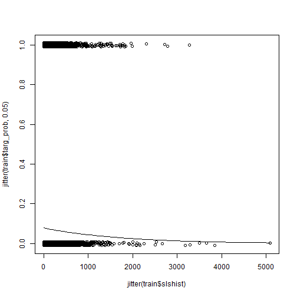
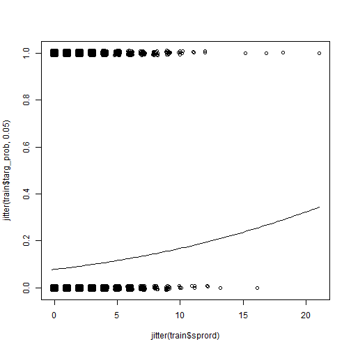
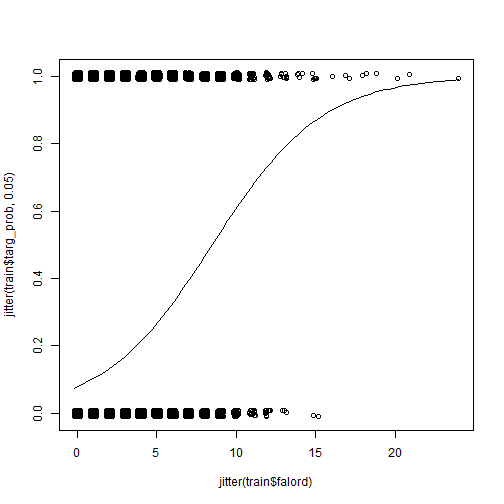

```r
library(tidyverse)
library(pROC)
library(car)
library(arm)
```


## Data Cleansing
We took 3 main steps to clean the data:
1) Change ordhist value to the sum of falord and sprord
2) Update the datelp6 year to match lpuryear where needed & Drop lpuryear
3) Create oldSales & oldOrds to capture the difference between the sum of the most recent 4 years of sales/orders and the total sales/orders


```r
#read data
csd <- read_csv("../catalog sales data.csv", 
                col_types = cols(datead6 = col_date(format = "%m/%d/%Y"), 
                                 datelp6 = col_date(format = "%m/%d/%Y")))

#1) create new ordhist by adding falord and sprord
csd$ordhist <- csd$falord + csd$sprord

#2) Update daltelp6
csd[is.na(csd$lpuryear) == FALSE & substr(csd$datelp6,4,4) < csd$lpuryear & as.numeric(paste0(substr(csd$datelp6,3,3),csd$lpuryear)) < 13,] <- csd %>% filter(is.na(lpuryear) == FALSE & substr(datelp6,4,4) < lpuryear & as.numeric(paste0(substr(datelp6,3,3),lpuryear)) < 13) %>%
  mutate(datelp6 = as.Date(paste0(substr(datelp6,1,3), lpuryear,"-06-30")))
```

```
## Warning in evalq(is.na(lpuryear) == FALSE & substr(datelp6, 4, 4) <
## lpuryear & : NAs introduced by coercion
```

```
## Warning in `[<-.data.frame`(`*tmp*`, is.na(csd$lpuryear) == FALSE &
## substr(csd$datelp6, : NAs introduced by coercion
```

```r
#Drop lpuryear
csd <- subset(csd, select = -c(lpuryear))
```


```r
#3) Adding columns for sales and orders more than 3 years ago
new_csd <- csd %>%
  mutate(oldOrds = sprord + falord - (ordtyr + ordlyr + ord2ago + ord3ago)) %>%
  mutate(oldSales = slshist - (slstyr + slslyr + sls2ago + sls3ago)) %>%
  #filter(!((as.integer(substr(datelp6,1,4)) - 3 <= as.integer(substr(datead6,1,4))) & (oldOrds != 0) & (oldSales !=0))) %>%
  mutate(oldOrds = ifelse(oldOrds < 0, 0, oldOrds))
```


```r
sales <- read_csv("../catalog sales data.csv", 
                col_types = cols(datead6 = col_date(format = "%m/%d/%Y"), 
                                 datelp6 = col_date(format = "%m/%d/%Y")))
```

The latest date: 2012/12/01

```r
new_csd <- new_csd %>%
  mutate(days = (2012-as.integer(substr(datelp6,1,4)))*12*30 + (12 - as.integer(substr(datelp6,6,7)))*30 + (1-as.integer(substr(datelp6,9,10)))) %>%
  mutate(recency = days/365)
```


```r
new_csd <- new_csd %>%
  mutate(factyr = ifelse(slstyr>0, 1, 0)) %>%
  mutate(faclyr = ifelse(slslyr>0, 1, 0)) %>%
  mutate(fac2ago = ifelse(sls2ago>0, 1, 0)) %>%
  mutate(fac3ago = ifelse(sls3ago>0, 1, 0))
```


```r
new_csd <- new_csd %>%
  mutate(avgtyr = ifelse(ordtyr>0, slstyr/ordtyr, 0)) %>%
  mutate(avglyr = ifelse(ordlyr>0, slslyr/ordlyr, 0)) %>%
  mutate(avg2ago = ifelse(ord2ago>0, sls2ago/ord2ago, 0)) %>%
  mutate(avg3ago = ifelse(ord3ago>0, sls3ago/ord3ago, 0)) %>%
  mutate(avghist = ifelse((falord+sprord)>0, slshist/(falord+sprord), 0))
```


```r
new_csd <- new_csd %>%
  mutate(targ_prob = ifelse(targdol > 0, 1, 0)) %>%
  mutate(factyr = ifelse(ordtyr>0, 1, ordtyr)) %>%
  mutate(factyr = factor(factyr, levels=c(0,1))) %>%
  mutate(faclyr = ifelse(ordlyr>0, 1, ordlyr)) %>%
  mutate(faclyr = factor(faclyr, levels=c(0,1))) %>%
  mutate(fac2ago = ifelse(ord2ago>0, 1, ord2ago)) %>%
  mutate(fac2ago = factor(fac2ago, levels=c(0,1))) %>%
  mutate(fac3ago = ifelse(ord3ago>0, 1, ord3ago)) %>%
  mutate(fac3ago = factor(fac3ago, levels=c(0,1)))
```


```r
new_csd <- new_csd %>%
  mutate(recency_fac = ifelse(recency>=5, 5, ifelse(recency>=4.75, 4.75,ifelse(recency>=4.5, 4.5, ifelse(recency>=4.25, 4.25, ifelse(recency>=4, 4, ifelse(recency>=3.75, 3.75,ifelse(recency>=3.5, 3.5, ifelse(recency>=3.25, 3.25, ifelse(recency>3, 3, ifelse(recency>=2.75, 2.75, ifelse(recency>=2.5, 2.5, ifelse(recency>=2.25, 2.25, ifelse(recency>=2, 2, ifelse(recency>=1.75, 1.75, ifelse(recency>=1.5, 1.5, ifelse(recency>=1.25, 1.25, ifelse(recency>=1, 1, ifelse(recency>=0.75, 0.75, ifelse(recency>=0.5, 0.5, ifelse(recency>=0.25, 0.25, 0 ))))))))))))))))))))) %>%
  mutate(recency_fac = factor(recency_fac))
```

Make days_on as days since added

```r
new_csd$days_on <- as.numeric(as.Date('2012/12/1') - new_csd$datead6)
summary(new_csd$days_on)
```

```
##    Min. 1st Qu.  Median    Mean 3rd Qu.    Max. 
##       1    1048    1786    2108    2622   29769
```


```r
new_csd$days_on1 <- ifelse(new_csd$days_on<800,1,0)
new_csd$days_on2 <- ifelse(new_csd$days_on>=800 & new_csd$days_on<1600,1,0)
new_csd$days_on3 <- ifelse(new_csd$days_on>=1600 & new_csd$days_on<2600,1,0)
new_csd$days_on4 <- ifelse(new_csd$days_on>=2600 & new_csd$days_on<6000,1,0)
new_csd$days_on5 <- ifelse(new_csd$days_on>=6000,1,0)

##add small amount for log transformation later
new_csd$slshist <- ifelse(new_csd$slshist==0,0.0001,new_csd$slshist)
new_csd$avghist <- ifelse(new_csd$avghist==0,0.0001,new_csd$avghist)
```


```r
train <- new_csd[new_csd$train == 1,]
test <- new_csd[new_csd$train == 0,]
```

get rid of training data set outlier (falord)

```r
train <- train %>%
  filter(falord < 80)
```


```r
train_pur <- train %>% filter(targ_prob > 0)
test_pur <- test %>% filter(targ_prob > 0)
```

## Apply logistic model to predict whether the customer would buy.

Create a new response variable targ_prob for logistic model

```r
train$targ_prob <- ifelse(train$targdol > 0, 1, 0)
test$targ_prob <- ifelse(test$targdol > 0, 1, 0)
print('training data table:')
```

```
## [1] "training data table:"
```

```r
train_baseline <- table(train$targ_prob)/sum(table(train$targ_prob))
train_baseline
```

```
## 
##          0          1 
## 0.90390146 0.09609854
```

```r
print('test data table:')
```

```
## [1] "test data table:"
```

```r
test_baseline <- table(test$targ_prob)/sum(table(test$targ_prob))
test_baseline
```

```
## 
##          0          1 
## 0.90754001 0.09245999
```

Baseline accuracy:

```r
print('training data baseline:')
```

```
## [1] "training data baseline:"
```

```r
train_baseline[[1]]/sum(train_baseline)
```

```
## [1] 0.9039015
```

```r
print('test data baseline:')
```

```
## [1] "test data baseline:"
```

```r
test_baseline[[1]]/sum(test_baseline)
```

```
## [1] 0.90754
```

Utility function: calculate the measures of Correct Classification, based on confusion matrix, including accuracy, precision, recall, and F1_score.

```r
class_Measure <- function(conf_matrix){
  accuracy <- sum(diag(conf_matrix))/sum(conf_matrix)
  precision <- unname(conf_matrix[2,2]/colSums(conf_matrix)[2])
  recall <- unname(conf_matrix[2,2]/rowSums(conf_matrix)[2])
  f1_score <- unname(2*precision*recall/(precision+recall))
  list(Accuracy = accuracy, Precision = precision, Recall = recall, Fscore = f1_score)
}
```

Utility function: Scan the threshold for the highest F score by grid search

```r
search_cutoff <- function(data_resp, data_pred, step=0.01){
  
  cutoff <- seq(0, 0.99, step)
  Fscore_max <- 0
  F_threshold <- 0
  Accuracy_max <- 0
  Acc_threshold <- 0
  for (prob_thr in cutoff) {
    prob_pred <- ifelse(data_pred<prob_thr, 0, 1)
    prob_pred <- factor(prob_pred, levels=c(0,1))
    conf_matrix <- table(data_resp, prob_pred)
    pred_perf <- class_Measure(conf_matrix)
    if (pred_perf$Fscore > Fscore_max) {
      F_threshold <- prob_thr
      Fscore_max <- pred_perf$Fscore
    }
    if ((pred_perf$Accuracy) > Accuracy_max) {
      Acc_threshold <- prob_thr
      Accuracy_max <- pred_perf$Accuracy
    }
  }
  list(MaxFscore = Fscore_max, FsCutoff = F_threshold, MaxAccuracy = Accuracy_max, AccCutoff = Acc_threshold)
}
```

### Logistic model: consider both consistency and recency

a full model including all interaction terms related to consistency

```r
logist <- glm(targ_prob ~ slshist+falord+sprord+recency_fac+factyr*faclyr*fac2ago*fac3ago, family = "binomial", data = train)
summary(logist)
```

```
## 
## Call:
## glm(formula = targ_prob ~ slshist + falord + sprord + recency_fac + 
##     factyr * faclyr * fac2ago * fac3ago, family = "binomial", 
##     data = train)
## 
## Deviance Residuals: 
##     Min       1Q   Median       3Q      Max  
## -2.6408  -0.3853  -0.2339  -0.0001   3.4562  
## 
## Coefficients:
##                                     Estimate Std. Error z value Pr(>|z|)
## (Intercept)                       -2.466e+00  2.555e-01  -9.651  < 2e-16
## slshist                           -5.994e-04  1.512e-04  -3.963 7.40e-05
## falord                             2.904e-01  1.461e-02  19.875  < 2e-16
## sprord                             8.620e-02  1.941e-02   4.441 8.95e-06
## recency_fac0.5                     3.559e+00  1.924e-01  18.495  < 2e-16
## recency_fac0.75                    1.286e+00  2.108e-01   6.101 1.05e-09
## recency_fac1                       2.139e+00  1.917e-01  11.156  < 2e-16
## recency_fac1.25                   -1.859e+01  2.686e+02  -0.069 0.944820
## recency_fac1.5                    -7.935e-01  2.800e-01  -2.834 0.004597
## recency_fac1.75                   -1.905e+01  2.445e+02  -0.078 0.937883
## recency_fac2                      -1.731e+00  2.780e-01  -6.226 4.79e-10
## recency_fac2.25                   -1.902e+01  5.717e+02  -0.033 0.973463
## recency_fac2.5                    -7.451e-01  2.658e-01  -2.803 0.005058
## recency_fac2.75                   -1.801e+01  2.027e+02  -0.089 0.929194
## recency_fac3                      -7.757e-01  2.599e-01  -2.985 0.002837
## recency_fac3.25                   -1.805e+01  6.607e+02  -0.027 0.978203
## recency_fac3.5                    -8.861e-01  2.744e-01  -3.230 0.001239
## recency_fac3.75                   -8.315e-01  2.625e-01  -3.168 0.001536
## recency_fac4                      -1.786e+01  2.245e+02  -0.080 0.936581
## recency_fac4.25                   -1.759e+01  6.691e+02  -0.026 0.979021
## recency_fac4.5                    -9.171e-01  2.854e-01  -3.213 0.001313
## recency_fac4.75                   -1.025e+00  2.689e-01  -3.810 0.000139
## recency_fac5                      -1.680e+00  2.608e-01  -6.441 1.19e-10
## factyr1                           -2.082e+00  1.767e-01 -11.784  < 2e-16
## faclyr1                            1.352e+00  2.484e-01   5.442 5.27e-08
## fac2ago1                           3.612e-01  2.221e-01   1.626 0.103848
## fac3ago1                           2.977e-01  1.893e-01   1.573 0.115806
## factyr1:faclyr1                   -5.417e-01  2.603e-01  -2.081 0.037450
## factyr1:fac2ago1                  -2.338e-01  2.450e-01  -0.954 0.340115
## faclyr1:fac2ago1                  -3.526e-02  2.407e-01  -0.146 0.883534
## factyr1:fac3ago1                  -3.086e-01  2.240e-01  -1.378 0.168309
## faclyr1:fac3ago1                   7.906e-02  2.221e-01   0.356 0.721830
## fac2ago1:fac3ago1                 -1.528e-02  2.142e-01  -0.071 0.943144
## factyr1:faclyr1:fac2ago1          -9.061e-02  2.904e-01  -0.312 0.755041
## factyr1:faclyr1:fac3ago1          -4.408e-01  2.948e-01  -1.495 0.134876
## factyr1:fac2ago1:fac3ago1          5.498e-01  2.882e-01   1.907 0.056473
## faclyr1:fac2ago1:fac3ago1         -2.328e-01  2.804e-01  -0.830 0.406481
## factyr1:faclyr1:fac2ago1:fac3ago1  2.863e-01  3.992e-01   0.717 0.473347
##                                      
## (Intercept)                       ***
## slshist                           ***
## falord                            ***
## sprord                            ***
## recency_fac0.5                    ***
## recency_fac0.75                   ***
## recency_fac1                      ***
## recency_fac1.25                      
## recency_fac1.5                    ** 
## recency_fac1.75                      
## recency_fac2                      ***
## recency_fac2.25                      
## recency_fac2.5                    ** 
## recency_fac2.75                      
## recency_fac3                      ** 
## recency_fac3.25                      
## recency_fac3.5                    ** 
## recency_fac3.75                   ** 
## recency_fac4                         
## recency_fac4.25                      
## recency_fac4.5                    ** 
## recency_fac4.75                   ***
## recency_fac5                      ***
## factyr1                           ***
## faclyr1                           ***
## fac2ago1                             
## fac3ago1                             
## factyr1:faclyr1                   *  
## factyr1:fac2ago1                     
## faclyr1:fac2ago1                     
## factyr1:fac3ago1                     
## faclyr1:fac3ago1                     
## fac2ago1:fac3ago1                    
## factyr1:faclyr1:fac2ago1             
## factyr1:faclyr1:fac3ago1             
## factyr1:fac2ago1:fac3ago1         .  
## faclyr1:fac2ago1:fac3ago1            
## factyr1:faclyr1:fac2ago1:fac3ago1    
## ---
## Signif. codes:  0 '***' 0.001 '**' 0.01 '*' 0.05 '.' 0.1 ' ' 1
## 
## (Dispersion parameter for binomial family taken to be 1)
## 
##     Null deviance: 31906  on 50416  degrees of freedom
## Residual deviance: 21983  on 50379  degrees of freedom
## AIC: 22059
## 
## Number of Fisher Scoring iterations: 18
```

stepwise selection to reduce variable number

```r
steplogist <- step(logist, trace=FALSE)
```

###Final logistic model

```r
summary(steplogist)
```

```
## 
## Call:
## glm(formula = targ_prob ~ slshist + falord + sprord + recency_fac + 
##     factyr + faclyr + fac2ago + fac3ago + factyr:faclyr + factyr:fac2ago + 
##     factyr:fac3ago + faclyr:fac3ago + fac2ago:fac3ago + factyr:faclyr:fac3ago + 
##     factyr:fac2ago:fac3ago, family = "binomial", data = train)
## 
## Deviance Residuals: 
##     Min       1Q   Median       3Q      Max  
## -2.6439  -0.3860  -0.2339  -0.0001   3.4557  
## 
## Coefficients:
##                             Estimate Std. Error z value Pr(>|z|)    
## (Intercept)               -2.460e+00  2.342e-01 -10.502  < 2e-16 ***
## slshist                   -5.992e-04  1.514e-04  -3.959 7.54e-05 ***
## falord                     2.898e-01  1.458e-02  19.877  < 2e-16 ***
## sprord                     8.608e-02  1.942e-02   4.433 9.28e-06 ***
## recency_fac0.5             3.559e+00  1.923e-01  18.504  < 2e-16 ***
## recency_fac0.75            1.286e+00  2.108e-01   6.101 1.05e-09 ***
## recency_fac1               2.138e+00  1.917e-01  11.158  < 2e-16 ***
## recency_fac1.25           -1.857e+01  2.684e+02  -0.069 0.944833    
## recency_fac1.5            -7.738e-01  2.752e-01  -2.812 0.004929 ** 
## recency_fac1.75           -1.903e+01  2.444e+02  -0.078 0.937933    
## recency_fac2              -1.711e+00  2.730e-01  -6.266 3.70e-10 ***
## recency_fac2.25           -1.900e+01  5.692e+02  -0.033 0.973370    
## recency_fac2.5            -6.994e-01  2.522e-01  -2.773 0.005554 ** 
## recency_fac2.75           -1.796e+01  2.026e+02  -0.089 0.929352    
## recency_fac3              -7.243e-01  2.417e-01  -2.996 0.002734 ** 
## recency_fac3.25           -1.804e+01  6.631e+02  -0.027 0.978295    
## recency_fac3.5            -9.398e-01  2.707e-01  -3.472 0.000517 ***
## recency_fac3.75           -8.977e-01  2.566e-01  -3.498 0.000469 ***
## recency_fac4              -1.794e+01  2.245e+02  -0.080 0.936332    
## recency_fac4.25           -1.763e+01  6.683e+02  -0.026 0.978948    
## recency_fac4.5            -9.353e-01  2.737e-01  -3.417 0.000633 ***
## recency_fac4.75           -1.035e+00  2.529e-01  -4.094 4.24e-05 ***
## recency_fac5              -1.685e+00  2.410e-01  -6.990 2.74e-12 ***
## factyr1                   -2.080e+00  1.478e-01 -14.073  < 2e-16 ***
## faclyr1                    1.330e+00  1.892e-01   7.029 2.07e-12 ***
## fac2ago1                   3.134e-01  9.821e-02   3.191 0.001415 ** 
## fac3ago1                   3.696e-01  1.415e-01   2.613 0.008987 ** 
## factyr1:faclyr1           -5.486e-01  2.008e-01  -2.733 0.006280 ** 
## factyr1:fac2ago1          -2.355e-01  1.258e-01  -1.872 0.061218 .  
## factyr1:fac3ago1          -3.697e-01  1.760e-01  -2.101 0.035650 *  
## faclyr1:fac3ago1          -5.094e-02  1.416e-01  -0.360 0.718990    
## fac2ago1:fac3ago1         -1.200e-01  1.363e-01  -0.881 0.378394    
## factyr1:faclyr1:fac3ago1  -3.234e-01  1.949e-01  -1.659 0.097109 .  
## factyr1:fac2ago1:fac3ago1  6.692e-01  1.962e-01   3.410 0.000649 ***
## ---
## Signif. codes:  0 '***' 0.001 '**' 0.01 '*' 0.05 '.' 0.1 ' ' 1
## 
## (Dispersion parameter for binomial family taken to be 1)
## 
##     Null deviance: 31906  on 50416  degrees of freedom
## Residual deviance: 21985  on 50383  degrees of freedom
## AIC: 22053
## 
## Number of Fisher Scoring iterations: 18
```

###multicollinearity between predictor variables in logistic models

```r
vif(steplogist)
```

```
##                               GVIF Df GVIF^(1/(2*Df))
## slshist                   1.853696  1        1.361505
## falord                    2.424419  1        1.557055
## sprord                    1.814027  1        1.346858
## recency_fac            2660.542320 19        1.230639
## factyr                   16.847335  1        4.104551
## faclyr                   25.737053  1        5.073170
## fac2ago                   6.517898  1        2.553017
## fac3ago                  12.543678  1        3.541705
## factyr:faclyr            16.078217  1        4.009765
## factyr:fac2ago            5.337541  1        2.310312
## factyr:fac3ago            8.872001  1        2.978590
## faclyr:fac3ago            6.129645  1        2.475812
## fac2ago:fac3ago           6.352441  1        2.520405
## factyr:faclyr:fac3ago     6.042961  1        2.458243
## factyr:fac2ago:fac3ago    6.770562  1        2.602030
```

### Performance Measure: Accuracy, F1 Score

```r
print('on training set')
```

```
## [1] "on training set"
```

```r
prob_cutoff <- search_cutoff(train$targ_prob, steplogist$fitted.values)

print('on test set')
```

```
## [1] "on test set"
```

```r
targ_test_pred <- predict(steplogist, newdata=test, type='response')

print('Base on the highest Accuracy of training set')
```

```
## [1] "Base on the highest Accuracy of training set"
```

```r
test_conf_mat <- table(test$targ_prob, targ_test_pred > prob_cutoff$AccCutoff)
class_Measure(test_conf_mat)
```

```
## $Accuracy
## [1] 0.9271237
## 
## $Precision
## [1] 0.7874785
## 
## $Recall
## [1] 0.2900973
## 
## $Fscore
## [1] 0.4239988
```

```r
print('Base on the highest F scocre of training set')
```

```
## [1] "Base on the highest F scocre of training set"
```

```r
test_conf_mat_f1 <- table(test$targ_prob, targ_test_pred > prob_cutoff$FsCutoff)
class_Measure(test_conf_mat_f1)
```

```
## $Accuracy
## [1] 0.9176547
## 
## $Precision
## [1] 0.5680084
## 
## $Recall
## [1] 0.4568345
## 
## $Fscore
## [1] 0.5063915
```


#### purchase probability vs slshist

```r
plot(jitter(train$targ_prob, 0.05) ~ jitter(train$slshist))
curve(invlogit (coef(steplogist)[1] + coef(steplogist)['slshist']*x), add=TRUE)
```



#### purchase probability vs slshist

```r
plot(jitter(train$targ_prob, 0.05) ~ jitter(train$sprord))
curve(invlogit (coef(steplogist)[1] + coef(steplogist)['sprord']*x), add=TRUE)
```



####purchase probability vs falord

```r
plot(jitter(train$targ_prob, 0.05) ~ jitter(train$falord))
curve(invlogit (coef(steplogist)[1] + coef(steplogist)['falord']*x), add=TRUE)
```



###Multiple regression on the amount of purchase by Matt


```r
#Make days_on as days since added 
new_csd$days_on <- as.numeric(as.Date('2012/12/1') - new_csd$datead6)
summary(new_csd$days_on)
```

```
##    Min. 1st Qu.  Median    Mean 3rd Qu.    Max. 
##       1    1048    1786    2108    2622   29769
```

### model purchase amount that is larger than zero.

```r
train_pur <- train %>% filter(targ_prob > 0)
test_pur <- test %>% filter(targ_prob > 0)
```

####use training data set mean to calculate the MSPE baseline

```r
mspe_fit0 <- sum((test_pur$targdol - mean(train_pur$targdol))^2)/(nrow(test_pur)-1)
mspe_fit0
```

```
## [1] 2754.089
```

### Step1: base model

```r
pur_fit_1 <- lm(targdol ~ days_on1+days_on2+days_on3  + log(slshist) + ordtyr  + oldOrds + faclyr + fac2ago + fac3ago + avgtyr + avglyr + avg2ago + avg3ago +slstyr:ordtyr, data=train_pur)
summary(pur_fit_1)
```

```
## 
## Call:
## lm(formula = targdol ~ days_on1 + days_on2 + days_on3 + log(slshist) + 
##     ordtyr + oldOrds + faclyr + fac2ago + fac3ago + avgtyr + 
##     avglyr + avg2ago + avg3ago + slstyr:ordtyr, data = train_pur)
## 
## Residuals:
##     Min      1Q  Median      3Q     Max 
## -204.52  -24.65  -11.63    9.55 1659.62 
## 
## Coefficients:
##                Estimate Std. Error t value Pr(>|t|)    
## (Intercept)    22.91447    4.07948   5.617 2.05e-08 ***
## days_on1       10.60635    2.70620   3.919 9.00e-05 ***
## days_on2       10.77829    2.51396   4.287 1.84e-05 ***
## days_on3        7.18049    2.22142   3.232  0.00124 ** 
## log(slshist)    3.77186    0.89739   4.203 2.68e-05 ***
## ordtyr         -7.47338    1.42097  -5.259 1.51e-07 ***
## oldOrds         2.37806    0.43035   5.526 3.45e-08 ***
## faclyr1        -8.86452    1.88729  -4.697 2.71e-06 ***
## fac2ago1      -12.58607    2.22888  -5.647 1.73e-08 ***
## fac3ago1       -9.28058    2.10623  -4.406 1.07e-05 ***
## avgtyr          0.02984    0.02276   1.311  0.18985    
## avglyr          0.16560    0.02688   6.160 7.86e-10 ***
## avg2ago         0.27836    0.03307   8.417  < 2e-16 ***
## avg3ago         0.12273    0.02783   4.411 1.05e-05 ***
## ordtyr:slstyr   0.09252    0.01327   6.971 3.58e-12 ***
## ---
## Signif. codes:  0 '***' 0.001 '**' 0.01 '*' 0.05 '.' 0.1 ' ' 1
## 
## Residual standard error: 51.1 on 4830 degrees of freedom
## Multiple R-squared:  0.09694,	Adjusted R-squared:  0.09432 
## F-statistic: 37.03 on 14 and 4830 DF,  p-value: < 2.2e-16
```

```r
df <- nrow(test_pur) - pur_fit_1$rank
mspe_fit_1 <- sum((test_pur$targdol - predict(pur_fit_1, newdata=test_pur))^2)/df
mspe_fit_1
```

```
## [1] 2506.5
```

### Step 2: Find Outliers using base model

```r
base_reg<-pur_fit_1
st_res <- rstandard(base_reg)
sort(st_res[st_res>2] , decreasing = TRUE)[1:25]
```

```
##      1969       544       501      3778      1758      1870       116 
## 32.522538 11.817473  9.457357  8.869438  8.772929  7.278653  6.966899 
##      1734      1335         8      3892      4761      2626      1416 
##  6.671452  6.429268  6.210186  6.165736  5.832154  5.662454  5.324484 
##      4074      3358       695      2290      2306      2876      3237 
##  5.278440  5.145804  5.106191  5.093825  4.963826  4.950741  4.931820 
##      2364      1166      1887      2288 
##  4.906499  4.896596  4.894914  4.572277
```

```r
length(sort(st_res[st_res>2] , decreasing = TRUE))
```

```
## [1] 164
```

### Step 3: Find Cooks Distance using base model

```r
d_cut <- 4/(length(train_pur$targdol)-length(base_reg)-1)
cd <- cooks.distance(base_reg)
sort(cd[cd>d_cut] , decreasing = TRUE)[1:25]
```

```
##        1993        1969        1870        2283        4761         425 
## 1.147226369 0.183920348 0.107044122 0.087835210 0.086501277 0.056444896 
##        3476        2382        3330        2694         544         126 
## 0.037228042 0.033467829 0.030288761 0.028695273 0.017982012 0.015924820 
##         750         501         442        3615        1649        1365 
## 0.015597333 0.015333031 0.013638324 0.013492750 0.013173318 0.012636350 
##        3778        1790         519        1335        1758        4276 
## 0.012175894 0.011982208 0.011582916 0.010891482 0.010288273 0.010071829 
##        3135 
## 0.009737885
```

```r
length(cd[cd>d_cut])
```

```
## [1] 202
```

#### Step 4: Remove Ouliers and Influential Points from dataframe

```r
train_lm.1 <- train_pur
train_lm.1$st_res <- rstandard(base_reg)
train_lm.1$cd <- cooks.distance(base_reg)
train_lm.1 <- train_lm.1[(train_lm.1$st_res < 2 & train_lm.1$cd < d_cut),]
```

#### Step 5: Re-evaluate Model with cleaned dataframe

```r
clean_reg <- update(base_reg, . ~ .  
           
                    , data = train_lm.1)
summary(clean_reg)
```

```
## 
## Call:
## lm(formula = targdol ~ days_on1 + days_on2 + days_on3 + log(slshist) + 
##     ordtyr + oldOrds + faclyr + fac2ago + fac3ago + avgtyr + 
##     avglyr + avg2ago + avg3ago + ordtyr:slstyr, data = train_lm.1)
## 
## Residuals:
##     Min      1Q  Median      3Q     Max 
## -65.528 -19.056  -7.373  11.663 110.358 
## 
## Coefficients:
##               Estimate Std. Error t value Pr(>|t|)    
## (Intercept)   22.64417    2.68765   8.425  < 2e-16 ***
## days_on1       8.02068    1.55630   5.154 2.66e-07 ***
## days_on2       7.17491    1.44622   4.961 7.26e-07 ***
## days_on3       4.03319    1.26076   3.199  0.00139 ** 
## log(slshist)   2.53565    0.62486   4.058 5.03e-05 ***
## ordtyr        -6.67079    0.90711  -7.354 2.27e-13 ***
## oldOrds        1.42268    0.26375   5.394 7.24e-08 ***
## faclyr1       -6.10428    1.09182  -5.591 2.39e-08 ***
## fac2ago1      -9.59769    1.36844  -7.014 2.66e-12 ***
## fac3ago1      -6.12545    1.26764  -4.832 1.39e-06 ***
## avgtyr         0.09861    0.01817   5.427 6.03e-08 ***
## avglyr         0.13840    0.01766   7.838 5.65e-15 ***
## avg2ago        0.21767    0.02547   8.546  < 2e-16 ***
## avg3ago        0.12912    0.02064   6.255 4.34e-10 ***
## ordtyr:slstyr  0.07751    0.01068   7.260 4.54e-13 ***
## ---
## Signif. codes:  0 '***' 0.001 '**' 0.01 '*' 0.05 '.' 0.1 ' ' 1
## 
## Residual standard error: 27.99 on 4570 degrees of freedom
## Multiple R-squared:  0.1378,	Adjusted R-squared:  0.1352 
## F-statistic: 52.18 on 14 and 4570 DF,  p-value: < 2.2e-16
```

####Step 6: FIND MSPE

```r
r <- (test_pur$targdol)
p <- (predict(clean_reg,newdata=test_pur))
sum((r-p)^2)/(length(test_pur$targdol - length(clean_reg) -1))
```

```
## [1] 2513.57
```

##calculate the financial outcome


```r
test$targ_exp <- predict(clean_reg,newdata=test) * predict(steplogist, newdata=test, type='response')
top1000 <- test$targdol[order(test$targ_exp, decreasing = TRUE)[1:1000]]
payoff <- sum(top1000)
payoff
```

```
## [1] 52499.13
```

Theoretical maximal payoff

```r
max_payoff <- sum(tail(sort(test$targdol), 1000))
max_payoff
```

```
## [1] 120252.4
```

### model efficiency

```r
payoff/max_payoff
```

```
## [1] 0.4365745
```

